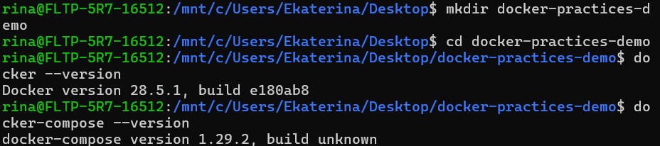
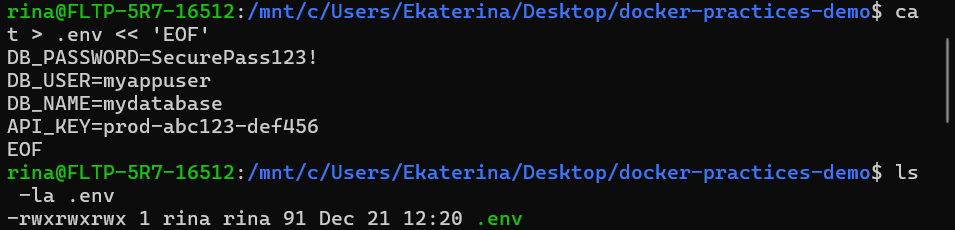
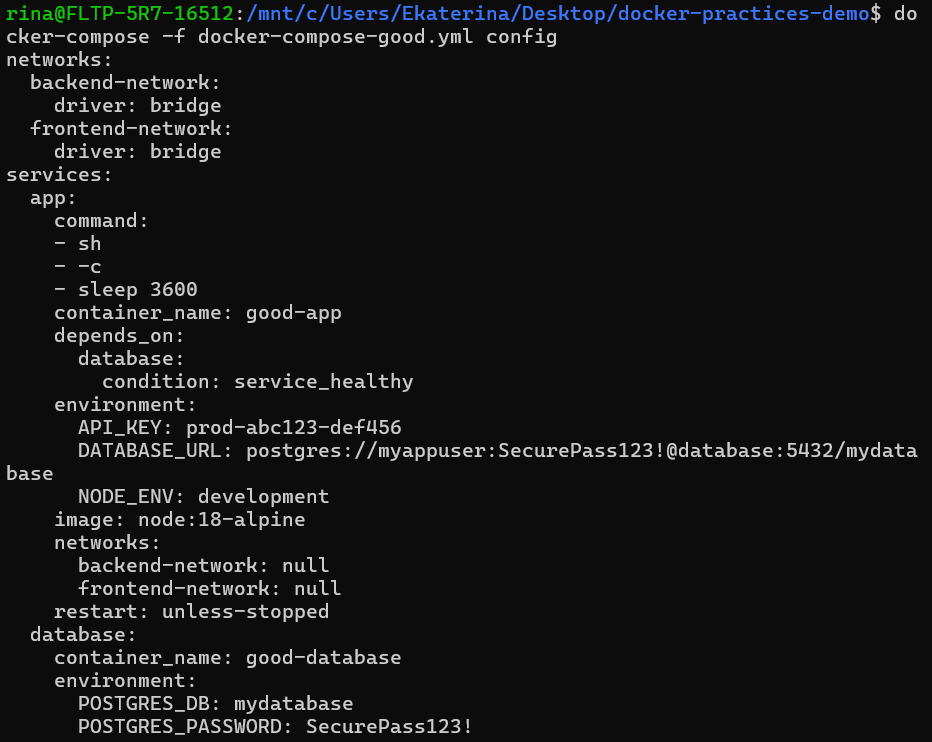
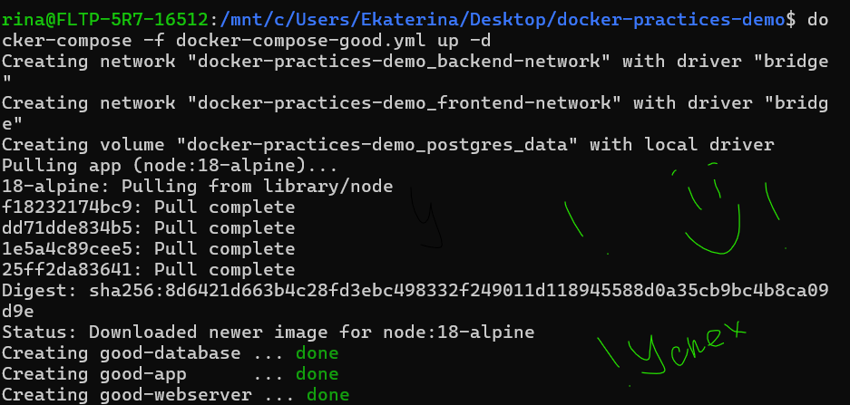
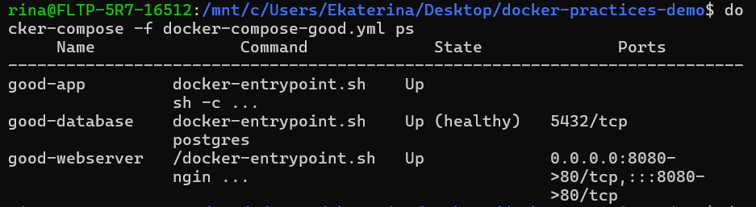
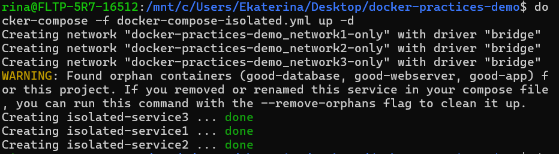
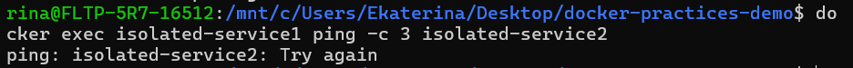
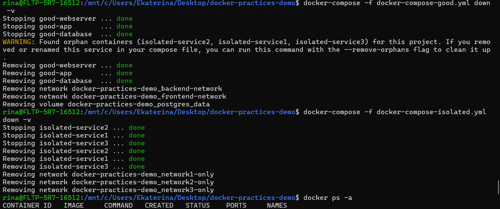

# Лабораторная работа 2*

## Вступление
Давайте немного покринжуем. Я искала на просторах инета хоть какое-то стихотворение про docker-compose(видимо, новогоднее настроение одолевает), но ничего не нашла. Поэтому довольствуемся тем, что выдала ИИ....не, ну кратко и для понимания

```
Хочешь поднять проект? Забудь про docker run!
Есть docker-compose – волшебный файл, где всё прописано.
База, кэш, и бэкенд – всё вместе, как семья,
И в одну строку всё взлетает, без напряга и огня!
```

В файле будут использлваны хорошие практики, которые я явно не прописывала, поэтому буду ставить возле них ⭐

## Часть 1. Знакоство

Для начала поговорим, что такое docker-compose и зачем он нужен.

```
Docker Compose — это инструментальное средство, входящее в состав Docker. Оно предназначено для решения задач, связанных с развёртыванием проектов.
```

```
Изучая основы Docker, вы могли столкнуться с созданием простейших приложений, работающих автономно, не зависящих, например, от внешних источников данных или от неких сервисов. На практике же подобные приложения — редкость. Реальные проекты обычно включают в себя целый набор совместно работающих приложений.
```

### Как понять, что нужен docker-compose?

Если для обеспечения функционирования этого проекта используется несколько сервисов, то используем docker-compose
Например, в ситуации, когда создают веб-сайт, которому, для выполнения аутентификации пользователей, нужно подключиться к базе данных. Подобный проект может состоять из двух сервисов — того, что обеспечивает работу сайта, и того, который отвечает за поддержку базы данных.

Технология Docker Compose, если описывать её упрощённо, позволяет, с помощью одной команды, запускать множество сервисов.


### Разница между Docker и Docker-compose

Docker применяется для управления отдельными контейнерами (сервисами), из которых состоит приложение.

Docker Compose используется для одновременного управления несколькими контейнерами, входящими в состав приложения. Этот инструмент предлагает те же возможности, что и Docker, но позволяет работать с более сложными приложениями.

## Часть 2. Практика.

1) Создаю свой какой-то проект `docker-practices-demo`
2) Проверяю версии инструментов, которые буду использовать



3) Напишем плохой Docker-compose файл.
<div align="center">
  
</div


```
version: '3'
services:
  webserver:
    image: nginx:latest
    container_name: my_webserver
    ports:
      - "80:80"
  database:
    image: postgres:latest
    container_name: my_database
    environment:
      POSTGRES_PASSWORD: SuperSecretPassword123!
      POSTGRES_USER: admin
      POSTGRES_DB: production_db
  app:
    build: .
    container_name: my_app
    depends_on:
      - database
    environment:
      - DATABASE_URL=localhost:5432
      - API_KEY=12345-secret-key
    volumes:
      - /home/user/app:/app
```
### Почему все плохо плохо плохо?

1. `latest`

Как и в Докерфайл лучше использовать конкретную версию. Например вчера мы тестировали все на Postgres 15.2, а сегодня уже выкатилась обнова Postgres 16.0, и на новой версии у меня все сломалось.
latest непредсказуем: он постоянно обновляется, может содержать сломанные версии или уязвимости, что затрудняет отладку и восстановление, и не дает гарантий стабильности

2. Пароли в коде это НЕБЕЗОПАСНО `SuperSecretPassword123!`
   
   Любой, кто получит доступ к коду, увидит ваш секретный ключ
   Ну  плюсом(точнее минусом) пароли будут в git истории, а еще их удобно нельз будет изменить.
   
3. `localhost:5432`
   
Может быть неудобно и приводить к конфликтам портов (если на хосте уже запущен Postgres или другой сервис на 5432), а также мешать правильной работе сетей Docker.
Лучше использовать имена сервисов (например, db или ura) в сети Docker или указывать другой, неконфликтующий порт хоста (например, 127.0.0.1:5433:5432) для изоляции и избежания ошибок.

4. Абсолютный путь `/home/user/app:/app` - плохо
   
   Работает только на машинах, где есть такой же путь(становимся очень зависимы от того, на чем работаем - А зачем тогда вообще докер нужон....)
   
Ну и соотвественно, вытекают проблемы:

- Не работает у других разработчиков
  
- Не работает у препода(хотя честно-честно у меня дома все работало)
  
- Не работает у любимой бабули
  
Могут возникнуть проблемы при деплои на сервере

### Давайте проверим наш плохой файл


#### Что и зачем?

`docker-compose -f <имя-файла.yml> config` — это мощный инструмент для проверки, отладки и понимания того, как Docker Compose видит вашу конфигурацию перед реальным запуском.

Если в файле docker-compose-bad.yml есть синтаксическая ошибка или недопустимая опция, команда config завершится с ошибкой и выведет сообщение о проблеме, что помогает её быстро найти.


Теперь запустим все сервисы, которые есть в нашем compose

`docker-compose -f docker-compose-bad.yml up -d` 

`Кстати вот на этой команде, очень хорошо использовать разные файлы настроек для разных целей. 
Например, docker-compose.yml - общие правила
docker-compose.dev.yml - для разработки
docker-compose.prod.yml - для прода`⭐

В данном случае, будет ошибка из-за выше описанных проблем

4) Перепишем плохой в хороший

```
version: '3.8'
services:
  # ИСПРАВЛЕНО: Конкретная версия + легкий образ
  webserver:
    image: nginx:1.23.3-alpine
    container_name: good-webserver
    ports:
      - "8080:80"
    networks:
      - frontend-network
    restart: unless-stopped
    depends_on:
      - app

  # ИСПРАВЛЕНО: Секреты через переменные окружения
  database:
    image: postgres:15-alpine
    container_name: good-database
    environment:
      POSTGRES_PASSWORD: ${DB_PASSWORD:-defaultpass}
      POSTGRES_USER: ${DB_USER:-appuser}
      POSTGRES_DB: ${DB_NAME:-appdb}
    volumes:
      - postgres_data:/var/lib/postgresql/data  # ИСПРАВЛЕНО: именованный volume
    networks:
      - backend-network
    restart: unless-stopped
    healthcheck:
      test: ["CMD-SHELL", "pg_isready -U ${DB_USER:-appuser}"]
      interval: 10s
      timeout: 5s
      retries: 5

  # ИСПРАВЛЕНО: Правильное имя хоста + безопасность
  app:
    image: node:18-alpine  # ИСПРАВЛЕНО: конкретный образ для демо
    container_name: good-app
    environment:
      - DATABASE_URL=postgres://${DB_USER:-appuser}:${DB_PASSWORD:-defaultpass}@database:5432/${DB_NAME:-appdb}
      - API_KEY=${API_KEY}
      - NODE_ENV=development
    networks:
      - frontend-network
      - backend-network
    depends_on:
      database:
        condition: service_healthy
    restart: unless-stopped
    command: ["sh", "-c", "sleep 3600"]  # Просто спим для демо

volumes:
  postgres_data:
    driver: local

networks:
  frontend-network:
    driver: bridge
  backend-network:
    driver: bridge
```


Так как он хороший, я считаю есть смысл его объяснить

### Объяснение 

`version: '3.8'` - версия формата Docker Compose - это указание схемы разметки в файле docker-compose.yml, которое контролировало совместимость и доступные директивы в старых версиях, но сейчас она часто избыточна, так как Compose по умолчанию использует последнюю спецификацию, хотя может использоваться для обратной совместимости или при наличии старых конфигураций. ⭐

`services:` - определение 3х контейнеров-сервисов `webserver`(nginx, оооо, привет), `database`(PostgreSQL), `app `(Node.js приложение), которые общаются друг с другом

`database`:
- Хранит данные приложения

- Данные сохраняются на диск (не теряются при перезапуске)

`webserver`:
- Принимает запросы из интернета

- Проксирует их на приложение

- Доступен по адресу: http://localhost:8080

`app`:
- Основная логика приложения


  `Кстати, сохранение модульности и целенаправленности - тоже хорошая практика
  (каждый сервис должен хорошо справляться с одной своей здачей, нпример, один для API Node.js, другой - PostgreSQL)` ⭐

- Может общаться и с базой, и с веб-сервером

5) Создадим файл с переменным окружением `.env`

+ проверяю, что все создано



6) Запустим хороший вариант
   `docker-compose -f docker-compose-good.yml config` - проверим конфигурацию
   

  `docker-compose -f docker-compose-good.yml up -d` - ПОЕХАЛИ!
   

`docker-compose -f docker-compose-good.yml ps` - чекаем статус в ВК нашего ненаглядного
 
   
`depends_on` - зависимости - нужно использовать с осторожностью, избегаем жесткие зависимости, чтобы уменьшить сложность. Используем, когда порядок запуска имеет решающее значение, плюс ест еще health checks⭐


## Что было исправлено?

- `latest` исправлены на конкретные весрии
   Например,
   `image: nginx:latest`
  `image: nginx:1.23.3-alpine` ⭐

(использование  alpine-образов (меньше размер, меньше уязвимостей))

- Спрятали данные
  Переменные окружения через ${VAR_NAME}⭐

  Значения по умолчанию через :-default

  Секреты загружаются из .env или Docker-секретов
  
   Например,
   `POSTGRES_PASSWORD: SuperSecretPassword123!`
  `POSTGRES_PASSWORD: ${DB_PASSWORD:-defaultpass}`

- Пофиксили имя хоста
  Использование имени сервиса (database) как DNS-имени.⭐

- Избавляемся от абсолютного пути⭐
  Например, 
  ```
  volumes:
  - /home/user/app:/app
  ```

  ```
  volumes:
  - postgres_data:/var/lib/postgresql/data

  volumes:
    postgres_data:
      driver: local
    
    ```

  - Плюсом, я узнала, что полезно использовать health checks⭐⭐⭐⭐⭐
 
    ```
    depends_on:
        - database
    ```

    ```
    depends_on:
      database:
        condition: service_healthy
    
    healthcheck:
      test: ["CMD-SHELL", "pg_isready -U ${DB_USER:-appuser}"]
      interval: 10s
      timeout: 5s
      retries: 5
     ```

    Почему их полезно использовать?
    Проблема: Контейнер приложения может стартовать до готовности БД.

  - Были добавлены явные сети ⭐

 
Выводы по исправлениям:
- Связь контейнеров - приложение теперь подключается к БД через DNS-имя

- Порядок запуска - приложение ждет готовности БД благодаря health check

- Одинаковое поведение везде

- Секреты защищены - пароли и ключи не в коде, а в переменных окружения

- Сетевая изоляция - фронтенд и бэкенд в раздельных сетях

- Минимальные образы - Alpine

Все стало лучше


## Давайте перейдем к последнему заданию

Вызвало еще больше затруднений чем предыдущие задания

Пришлось вспоминать первый сем информатики + копать инфу и использовать нейронку, давайте посмотрим что вышло

1) Проверим связб с бд

   `docker exec good-app ping -c 3 database`
   

2) Создадим полный файл с изоляцией

Делаем так, что каждый нас сервис находится в своей приватной сети(никакого межсервисного взаимодействия)

```
version: '3.8'
services:
  # Каждый сервис в своей ИЗОЛИРОВАННОЙ сети
  service1:
    image: nginx:1.23.3-alpine
    container_name: isolated-service1
    ports:
      - "8081:80"
    networks:
      - network1-only  # ТОЛЬКО этот контейнер
    restart: unless-stopped

  service2:
    image: nginx:1.23.3-alpine
    container_name: isolated-service2  
    ports:
      - "8082:80"
    networks:
      - network2-only  # ТОЛЬКО этот контейнер
    restart: unless-stopped

  service3:
    image: nginx:1.23.3-alpine
    container_name: isolated-service3
    ports:
      - "8083:80"
    networks:
      - network3-only  # ТОЛЬКО этот контейнер
    restart: unless-stopped

networks:
  network1-only:
    driver: bridge
  network2-only:
    driver: bridge  
  network3-only:
    driver: bridge
```
3) Запустим и протестируем

Запускаем изолированные контейнеры

   

   Проверяем все ли запущены

  


Пробуем пинговать
   
   
Не рабоотает. И это здорово)))))


### В чем прнцип такой изоляции:

- Каждый контейнер помещен в УНИКАЛЬНУЮ Docker сеть

- Контейнеры в разных сетях не могут общаться(:<)

- Но все запускаются одной командой 'docker-compose up'

Не забудьте в конце своей работы за собой прибраться!


   

<div align="center">
  
</div>

# Вывод по лабе: 
было сложновато, так как, если докерфайл я еще создавала, то в данном случае нужно было все с нуля делать, конечно помогали доп источники информации и нейронка. Долго не хотелось за эту лабу садиться, потому что все что связано с докером вызывает неохоту, я думаю, что это связано с тем, что я его на данный момент не использую в повседневных задачах. Очень жду момента, когда все полученнные навыки действительно можно будет применять. Ну и все задачи, поставленные в лабе, были выполнены, экспирианс был интересный, хоть и сложный.

Вот отсюда много чего взяла: `https://dev.to/wallacefreitas/10-best-practices-for-writing-maintainable-docker-compose-files-4ca2`


P.S. Я кстати, полазив, нашла еще практики, которые мне понравились

- `volumes` - размещаем внизу для лучшей читаемости⭐

- применяем ограничение на использование ресурсов, чтобы предотвратить монополизацию системных ресурсов любой службой⭐

<div align="center">
  
</div>
